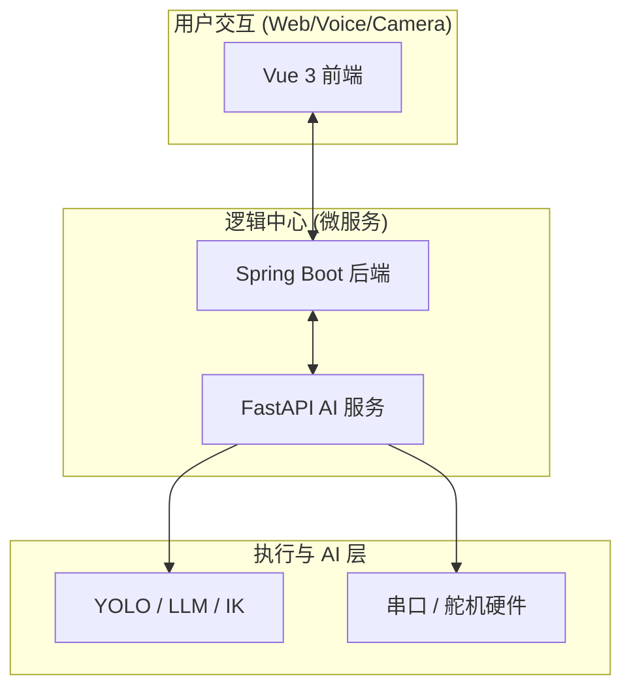
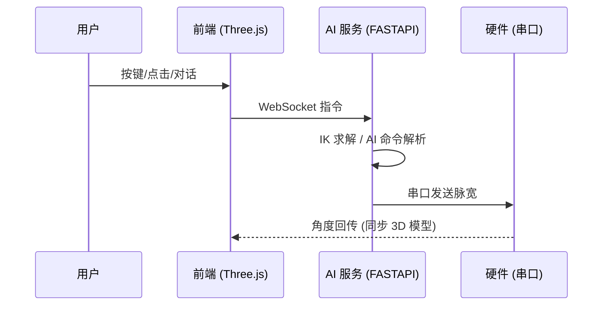
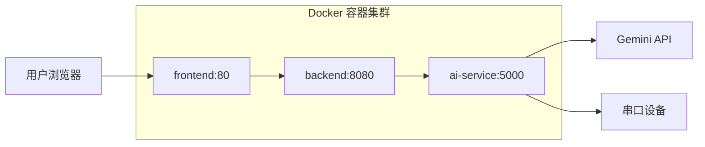

# 🗺️ 系统架构流程图 (精简版)

## 🏗️ 1. 整体架构 (三层结构)

```mermaid
graph TB
    subgraph "用户交互 (Web/Voice/Camera)"
        A[Vue 3 前端]
    end
    
    subgraph "逻辑中心 (微服务)"
        B1[Spring Boot 后端]
        B2[FastAPI AI 服务]
    end
    
    subgraph "执行与 AI 层"
        C1[YOLO / LLM / IK]
        C2[串口 / 舵机硬件]
    end
    
    A <--> B1 <--> B2
    B2 --> C1
    B2 --> C2
```

---

## 🔄 2. 指令执行流 (数据流向)

```mermaid
sequenceDiagram
    participant U as 用户
    participant F as 前端 (Three.js)
    participant A as AI 服务 (FASTAPI)
    participant H as 硬件 (串口)
    
    U->>F: 按键/点击/对话
    F->>A: WebSocket 指令
    A->>A: IK 求解 / AI 命令解析
    A->>H: 串口发送脉宽
    H-->>F: 角度回传 (同步 3D 模型)
```

---

## 🐳 3. 部署架构 (Docker Network)

```mermaid
graph LR
    subgraph "Docker 容器集群"
        F[frontend:80]
        B[backend:8080]
        AI[ai-service:5000]
    end
    
    U[用户浏览器] --> F
    F --> B
    B --> AI
    AI --> Cloud[Gemini API]
    AI --> Serial[串口设备]
```

---

**更新时间**：2026-01-29
