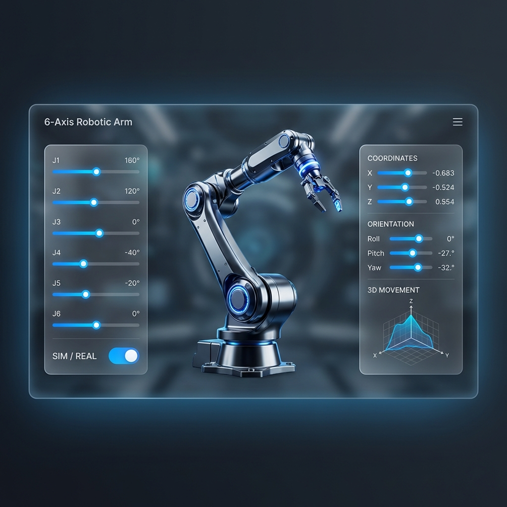
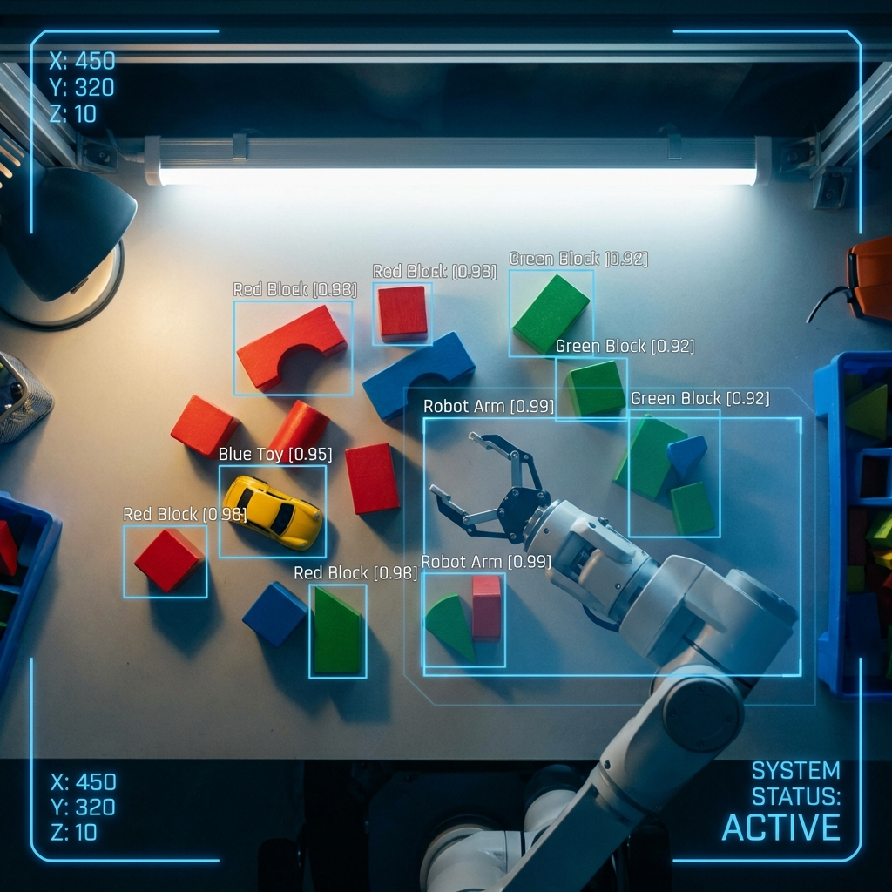
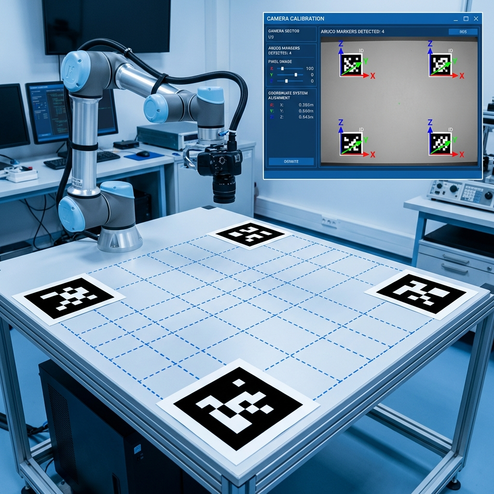

# 🦾 Zero 六轴机械臂：全功能演示与技术汇报

> **文档目的**：本报告旨在为项目汇报、PPT 展示提供真实的图文素材。每一章节均包含高清演示图及对应的技术要点解释，基于当前系统实际功能编写。
> **制作人员**：Zero 项目软件组
> **汇报日期**：2026年01月29日

---

## 1. 3D 可视化交互界面

### 💡 技术要点与功能说明
*   **实时 3D 仿真**：基于 **Three.js** 开发的数字孪生系统，实时渲染 6 轴机械臂的运动状态，确保软件模拟与硬件动作高度同步。
*   **多维度控制面板**：底部面板支持对关节角度的精准调试，结合键盘快捷键（WASD/QE等）可实现多轴联动，右侧面板实时反馈机械臂末端的 (X, Y, Z) 空间坐标。
*   **仿真/实物模式切换**：通过顶部导航栏的 **实物/Simulation** 切换按钮，用户可以在纯模拟调试与驱动实体机械臂之间无缝切换。
*   **控制模式反馈**：系统具备物理串口检测，当切换至实物模式时，界面会自动反馈串口连接状态（如“系统在线”或“串口未连接”）。

---

## 2. AI 视觉识别与实时物体标注

### 💡 技术要点与功能说明
*   **实时 YOLOv8 检测标注**：系统集成 YOLOv8 模型，直接在视频流中实现“毫秒级”物体检测，并实时叠加渲染边界框（Bounding Box）与类别标签。
*   **多目标并行识别**：支持同时识别画面中的多个目标（如积木、杯子、人等），并显示置信度评分，确保视觉感知的直观性。
*   **辅助 AI 决策深度融合**：检测出的坐标数据不仅用于视觉展示，还会实时同步给大模型路由器（LLM Router），支撑“帮我抓那个红积木”等高级交互意图。
*   **低延迟画面回传**：优化后的流媒体生成器在保持画框功能的同时，确保了视频画面的流畅度，支持本地摄像头及手机 IP 摄像头。

---

## 3. 自动化视觉标定系统

### 💡 技术要点与功能说明
*   **4点法标定逻辑**：系统内置 4 点标定助手，通过记录 4 个物理参考点，自动计算像素坐标到机械臂物理空间坐标的变换矩阵。
*   **ArUco 标志辅助**：支持 ArUco 黑白矩阵标志的自动识别与追踪，极大简化了标定流程，降低了人工对位的误差。
*   **精度表现**：优化后的标定算法可有效抑制相机畸变带来的影响，为物体抓取提供可靠的定位精度。
*   **可视化辅助工具**：内置标定进度面板，引导用户按步骤完成从“放置标记”到“计算变换”的完整闭环。

---

## 4. 大模型（LLM）驱动的智能交互

### 💡 技术要点与功能说明
*   **多层级意图解析系统**：采用“路由器”架构，自动解析用户自然语言（如“帮我拿那个红色积木并招手”），将其拆解为底层运动控制、复杂动作序列及视觉查询等多种任务。
*   **智能动作序列逻辑**：系统内置“动作库”与“任务调度器”，大模型可根据上下文逻辑，智能编排并执行一系列预定义动作（如点头、挥手、舞蹈等），赋予机械臂“拟人化”的交互体验。
*   **运动安全双重过滤**：为避免复杂动作导致物理碰撞或穿模，控制层集成了“关节限位 + 几何空间模拟”双重安全检查逻辑，确保运动姿态在安全包络线内。
*   **上下文感知与多轮对话**：对话系统具备长短期记忆（Memory SDK），能够理解“再来一次”或“换个方向”等指代性指令，显著提升了人机协作的自然度。
*   **端到端语音交互闭环**：深度整合百度 ASR 与本地/云端 TTS 技术，实现了从“语音指令输入”到“机械臂智能执行”再到“语音状态反馈”的完整閉环。

---

## 5. 项目总结与未来展望

### 🚀 核心优势总结
1.  **零门槛部署**：通过 Docker 容器化技术，极大降低了系统环境配置的复杂度。
2.  **软硬结合**：实现了从前端 3D 渲染、后端 MuJoCo 动力学仿真到实体硬件串口控制的完整闭环。
3.  **模块化设计**：AI 视觉、大模型交互、运动控制相互独立且灵活调用，易于二次开发。

### 📅 后续计划
*   **性能优化**：进一步降低 WebSocket 通信延迟与视觉推理开销。
*   **移动端适配**：优化在手机等移动设备上的触控操作体验。
*   **动作录制功能**：支持用户通过示教方式录制并重放自定义动作轨迹。
