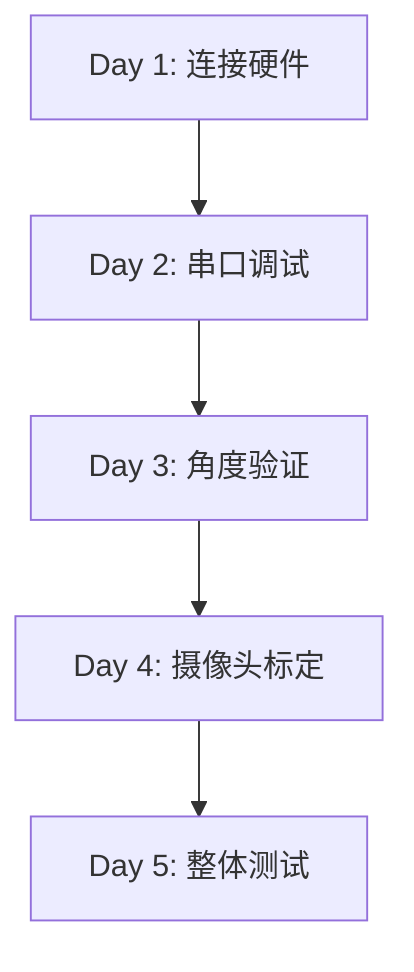

# 🔧 硬件调试完整指南

> **目标**：将你的 Zero 机械臂实体硬件接入系统,实现角度回传和摄像头标定。
>
> **预计时间**：3-5 天（首次调试）
>
> **前置条件**：
> - ✅ 已完成 [部署指南](DEPLOYMENT_GUIDE.md) 中的系统搭建
> - ✅ 机械臂硬件已组装完成
> - ✅ 系统已通过 Docker 模拟测试
> - ✅ 有 USB 转串口线（或蓝牙模块）
> - ✅ 有带 IP Camera 的手机（或 USB 摄像头）

---

## 📋 总体流程概览



---

## 🔌 Day 1: 硬件连接与环境准备

### 步骤 1.1：确认串口连接

#### Windows 系统

1. **连接机械臂 USB 线到电脑**

2. **查看串口号**：
   ```powershell
   # 方式 1：设备管理器
   devmgmt.msc
   # 展开 "端口(COM 和 LPT)"
   # 找到类似 "USB-SERIAL CH340 (COM3)" 的设备
   
   # 方式 2：PowerShell
   [System.IO.Ports.SerialPort]::getportnames()
   ```

   **预期输出**：
   ```
   COM3
   COM5
   ```

3. **记录串口号**：例如 `COM3`

#### Linux 系统

```bash
# 查看串口设备
ls /dev/ttyUSB* /dev/ttyACM*

# 预期输出
/dev/ttyUSB0

# 记录设备路径
```

---

### 步骤 1.2：配置串口参数

编辑 `ai-service/config.json`（基于 `config.json.example`）：

```json
{
  "SERIAL_ENABLED": true,
  "SERIAL_PORT": "COM3",           // Windows
  // "SERIAL_PORT": "/dev/ttyUSB0", // Linux
  "SERIAL_BAUDRATE": 115200,
  "SERIAL_TIMEOUT": 1.0,
  
  "CAMERA_ENABLED": false,   // 先不启用摄像头
  "GEMINI_API_KEY": "your-key-here"
}
```

**关键参数说明**：

| 参数 | 默认值 | 说明 |
|------|--------|------|
| `SERIAL_PORT` | `COM3` | 串口号，根据实际调整 |
| `SERIAL_BAUDRATE` | `115200` | 波特率，需与硬件固件一致 |
| `SERIAL_TIMEOUT` | `1.0` | 读取超时（秒） |

---

### 步骤 1.3：测试基础连接

运行串口测试脚本：

```bash
cd ai-service
python -c "
import serial
ser = serial.Serial('COM3', 115200, timeout=1)
print('串口已打开:', ser.is_open)
ser.close()
"
```

**预期输出**：
```
串口已打开: True
```

**常见错误**：

| 错误信息 | 原因 | 解决方案 |
|---------|------|---------|
| `PermissionError` | Linux 权限不足 | `sudo chmod 666 /dev/ttyUSB0` |
| `SerialException: Port already open` | 端口被占用 | 关闭其他串口监视工具 |
| `FileNotFoundError` | 串口号错误 | 重新检查设备管理器 |

---

## 📡 Day 2: 串口协议调试

### 步骤 2.1：理解你的硬件协议

#### 方式 A：如果你有硬件的串口文档

查看固件文档，确认：
1. **波特率**：通常是 `115200`
2. **数据格式**：JSON / CSV / 自定义
3. **指令格式**：例如 `#0P1500T1000\r\n`（舵机控制）
4. **回传格式**：例如 `{angles:[30,45,60,0,90,0]}`

#### 方式 B: 使用本地串口监视器 (推荐)

**工具**: `serial_monitor.py` - 本地 Python 串口监视器

**优点**:
- ✅ 无需下载外部软件
- ✅ 彩色输出,易于阅读
- ✅ 自动保存日志
- ✅ 实时显示收发数据

**操作步骤**:

1. **安装依赖**:
   ```powershell
   pip install -r tools/requirements.txt
   ```

2. **启动监视器** (方式 1 - 直接命令):
   ```powershell
   python tools/serial_monitor.py --port COM3 --baudrate 115200
   ```

3. **启动监视器** (方式 2 - 图形菜单):
   ```powershell
   # Windows
   debug-tools.bat
   
   # Linux/MacOS
   ./debug-tools.sh
   ```
   然后选择 `[1] 串口监视器`

4. **发送测试指令**:
   在监视器中直接输入命令并回车:
   ```
   [发送] > GET_ANGLES
   [发送] > {"action":"get_status"}
   ```

5. **观察返回数据**,记录格式

**界面示例**:
```
┌─ 📥 接收 (RX) ────────────────────────┐
│ [18:30:15.123] 0,30,45,60,0,90       │
│ [18:30:15.223] 0,30,45,60,0,90       │
└───────────────────────────────────────┘
┌─ 📤 发送 (TX) ────────────────────────┐
│ [18:30:14.500] GET_ANGLES            │
└───────────────────────────────────────┘
```

**典型协议示例**：

```
# 格式 1：JSON
发送: {"action":"get_angles"}
返回: {"angles_deg":[0,30,45,60,0,90]}

# 格式 2：CSV
发送: GET_ANGLES\r\n
返回: 0,30,45,60,0,90\r\n

# 格式 3：自定义
发送: ?STATUS
返回: A:0,30,45,60,0,90;E:0
```

---

### 步骤 2.2：修改 `serial_transport.py`

根据你的协议格式，修改 `read_status()` 方法。

#### 示例：适配 CSV 格式

如果你的硬件返回 `0,30,45,60,0,90\r\n`：

```python
# ai-service/serial_transport.py

def read_status(self):
    """读取机械臂当前状态（CSV 格式）"""
    if not self.connected:
        return self._mock_status()
    
    try:
        # 发送查询指令
        self.ser.write(b"GET_ANGLES\r\n")
        
        # 读取返回
        line = self.ser.readline().decode('utf-8').strip()
        
        if not line:
            return self._mock_status()
        
        # 解析 CSV: "0,30,45,60,0,90"
        angles_deg = [float(x) for x in line.split(',')]
        
        if len(angles_deg) != 6:
            raise ValueError(f"Expected 6 angles, got {len(angles_deg)}")
        
        return {
            "angles_deg": angles_deg,
            "angles_rad": [deg * 3.14159 / 180 for deg in angles_deg],
            "error_code": 0,
            "serial_mock": False
        }
    
    except Exception as e:
        print(f"Serial read error: {e}")
        return self._mock_status()
```

#### 示例：适配 JSON 格式

如果你的硬件返回 `{"angles":[0,30,45,60,0,90]}`：

```python
def read_status(self):
    """读取机械臂当前状态（JSON 格式）"""
    if not self.connected:
        return self._mock_status()
    
    try:
        # 发送查询指令
        self.ser.write(b'{"action":"get_status"}\r\n')
        
        # 读取返回
        line = self.ser.readline().decode('utf-8').strip()
        
        if not line:
            return self._mock_status()
        
        # 解析 JSON
        data = json.loads(line)
        angles_deg = data.get("angles", [0]*6)
        
        return {
            "angles_deg": angles_deg,
            "angles_rad": [deg * 3.14159 / 180 for deg in angles_deg],
            "error_code": data.get("error", 0),
            "serial_mock": False
        }
    
    except Exception as e:
        print(f"Serial read error: {e}")
        return self._mock_status()
```

---

### 步骤 2.3：修改 `send_command()`

根据你的硬件，修改发送指令的格式。

#### 示例：舵机协议（类似 LX-16A）

```python
def send_command(self, angles_rad):
    """发送角度指令（舵机协议）"""
    if not self.connected:
        print("[MOCK] Would send:", angles_rad)
        return True
    
    try:
        # 转换为舵机脉宽（500-2500μs）
        # 假设 -90° = 500μs, 90° = 2500μs
        for i, angle_rad in enumerate(angles_rad):
            angle_deg = angle_rad * 180 / 3.14159
            pulse = int(1500 + angle_deg * 11.11)  # 中心 1500μs
            pulse = max(500, min(2500, pulse))
            
            # 发送指令: #<ID>P<Pulse>T<Time>
            cmd = f"#{i}P{pulse}T1000\r\n"
            self.ser.write(cmd.encode())
        
        return True
    
    except Exception as e:
        print(f"Serial send error: {e}")
        return False
```

---

### 步骤 2.4：测试串口通信

创建测试脚本 `ai-service/test_serial.py`：

```python
#!/usr/bin/env python3
import time
from serial_transport import SerialTransport

# 初始化
transport = SerialTransport(
    port="COM3",
    baudrate=115200,
    enabled=True
)

print("=== 串口测试开始 ===\n")

# 测试 1: 读取当前角度
print("Test 1: 读取角度")
for i in range(5):
    status = transport.read_status()
    print(f"  [{i+1}] angles_deg: {status['angles_deg']}")
    print(f"      mock: {status['serial_mock']}")
    time.sleep(1)

print("\n" + "="*50 + "\n")

# 测试 2: 发送控制指令
print("Test 2: 发送指令")
test_angles = [0.0, 0.5, 0.8, 0.0, -0.3, 0.0]  # 弧度
success = transport.send_command(test_angles)
print(f"  发送结果: {'成功' if success else '失败'}")

print("\n=== 测试完成 ===")
transport.close()
```

运行测试：

```bash
python ai-service/test_serial.py
```

**预期输出（成功）**：
```
=== 串口测试开始 ===

Test 1: 读取角度
  [1] angles_deg: [0, 30, 45, 60, 0, 90]
      mock: False
  [2] angles_deg: [0, 30, 45, 60, 0, 90]
      mock: False
  ...

Test 2: 发送指令
  发送结果: 成功

=== 测试完成 ===
```

**预期输出（Mock 模式）**：
```
  [1] angles_deg: [0, 0, 0, 0, 0, 0]
      mock: True
```

---

## 🎯 Day 3: 角度回传验证

### 步骤 3.1：启动完整系统

```bash
cd robot-control-system
docker-compose up -d

# 查看日志
docker-compose logs -f ai-service
```

**关键日志**：
```
INFO: Serial connected: COM3 @ 115200
INFO: Telemetry broadcaster started (interval: 0.1s)
INFO: WebSocket /ws/mujoco opened
```

---

### 步骤 3.2：前端实时监控

1. 打开浏览器 `http://localhost`

2. 点击右上角 **"实物"** 按钮，切换到 physical 模式

3. 观察控制台输出（按 `F12`）：
   ```javascript
   WebSocket message: {
     type: "telemetry",
     data: {
       angles_deg: [0, 30, 45, 60, 0, 90],
       serial_mock: false
     }
   }
   ```

4. **手动移动机械臂**，观察前端角度是否实时更新

**验证方法**：
- 转动关节 1（基座） → 前端显示的第 1 个角度应变化
- 转动关节 2（大臂） → 第 2 个角度应变化
- 以此类推

---

### 步骤 3.3：校准角度零点

如果发现角度偏差（例如机械臂水平，但显示 30°）：

**方式 A：硬件校准（推荐）**
在固件中修正角度偏移量。

**方式 B：软件校准**

修改 `serial_transport.py`：

```python
# 角度校准偏移量（根据实际测量）
ANGLE_OFFSETS = [0, -30, 10, 0, 5, 0]  # 每个关节的零点偏移

def read_status(self):
    # ... 解析后 ...
    
    # 应用校准
    angles_deg = [
        raw_angles[i] + ANGLE_OFFSETS[i] 
        for i in range(6)
    ]
    
    return {
        "angles_deg": angles_deg,
        ...
    }
```

---

### 步骤 3.4：验证控制闭环

**测试目标**：发送指令 → 机械臂移动 → 角度回传确认

1. 在前端点击 **"基座旋转"** 按钮（A/D 键）

2. 观察：
   - 机械臂是否转动 ✅
   - 前端角度显示是否变化 ✅
   - 显示角度是否与实际一致 ✅

**调试建议**：

如果机械臂不动：
- 检查 `send_command()` 指令格式
- 用串口工具手动发送指令验证

如果角度不准：
- 调整 `ANGLE_OFFSETS` 校准参数
- 检查弧度/角度转换是否正确

---

## 📷 Day 4: 摄像头标定

### 步骤 4.0: 生成 ArUco 标记 (新增)

**使用本地工具生成标记,无需访问外部网站!**

#### 方式 1: 单个标记

```powershell
# 生成 ID=0 的标记
python tools/generate_aruco_marker.py --id 0 --size 200
```

输出: `aruco_marker_0.png`

#### 方式 2: A4 打印表 (推荐)

```powershell
# 生成包含多个标记的 A4 打印表
python tools/generate_aruco_marker.py --sheet --ids 0 1 2 3 4 5 6 7 8 9 10 11
```

输出: `aruco_sheet_4x4_50.png`

**打印建议**:
- ✅ 使用 A4 纸
- ✅ 彩色或黑白打印均可
- ✅ 确保打印质量清晰

---

### 步骤 4.1: 准备摄像头

#### 方案 A: IP Camera (推荐)

1. 在手机上安装 IP Camera 应用:
   - Android: [IP Webcam](https://play.google.com/store/apps/details?id=com.pas.webcam)
   - iOS: [iVCam](https://apps.apple.com/app/ivcam/id1164464478)

2. 启动应用,记录视频流地址:
   ```
   http://192.168.1.100:8080/video
   ```

3. 修改 `config.json`:
   ```json
   {
     "CAMERA_ENABLED": true,
     "CAMERA_URL": "http://192.168.1.100:8080/video"
   }
   ```

#### 方案 B: USB 摄像头

```json
{
  "CAMERA_ENABLED": true,
  "CAMERA_URL": "0"  // 0 表示默认摄像头
}
```

---

### 步骤 4.2: 固定摄像头位置

**关键要求**：
1. 摄像头位置**必须固定**，标定后不能移动
2. 尽量俯视拍摄（减少透视畸变）
3. 确保工作区域完全可见

**推荐安装位置**：
```
        📷 摄像头（俯视 45°）
         |
         |
    -----------
   |  🤖 机械臂  |  工作区域
    -----------
```

---

### 步骤 4.3: 使用本地标定助手 (推荐新方法)

**本地标定助手提供实时 ArUco 检测和标定流程!**

#### 启动标定助手

```powershell
# 使用默认摄像头
python tools/camera_calibration_helper.py

# 使用 IP Camera
python tools/camera_calibration_helper.py --camera http://192.168.1.100:8080/video
```

#### 操作流程

1. **启用 ArUco 检测**: 按 `a` 键
   - 将打印的 ArUco 标记放在工作区域
   - 软件会自动识别并显示标记中心点

2. **添加标定点**: 按 `空格` 键
   - 输入图像坐标 (u, v)
   - 输入世界坐标 (x, y, z)
   - 重复至少 4 次

3. **计算标定矩阵**: 按 `c` 键
   - 自动计算变换矩阵
   - 显示每个点的误差

4. **保存结果**: 按 `s` 键
   - 保存到 `calibration_data/calibration_YYYYMMDD_HHMMSS.json`

**界面示例**:
```
┌─ Camera Calibration Helper ───────────┐
│ ArUco Detection ON                    │
│ Calibration Points: 4                 │
│                                        │
│    [摄像头画面 + ArUco 标记高亮]       │
│    ● 1  ● 2                           │
│    ● 3  ● 4                           │
└───────────────────────────────────────┘
```

---

### 步骤 4.4: 传统前端标定流程 (备选)

如果你更喜欢使用前端界面标定:

1. 打开前端,点击 **"摄像头"** 按钮

2. 在画面上点击标记物位置 (重复 4 次)
   - 每次点击后移动机械臂到该点
   - 记录坐标

3. 点击 **"计算变换矩阵"**

**预期输出**:
```
标定完成!
变换矩阵已保存: calibration_matrix.json
误差: 2.3 mm
```

---

### 步骤 4.5: 验证标定精度

1. 在画面上**随机点击一个新位置**

2. 点击确认后，观察机械臂是否**自动移动到该点**

3. 测量误差：
   - 优秀：< 5mm
   - 良好：5-10mm
   - 需重新标定：> 10mm

**提高精度的方法**：
- 使用 ArUco 标记自动检测(更精确)
- 增加标定点数量（6-8 个点）
- 选择分布更均匀的点
- 使用更高分辨率的摄像头
- 减少摄像头畸变（使用镜头校正）

---

## 🧪 Day 5: 整体集成测试

### 测试用例清单

#### ✅ 用例 1：模拟模式测试

| 步骤 | 操作 | 预期结果 |
|------|------|---------|
| 1 | 启动系统，默认模拟模式 | 3D 模型正常显示 |
| 2 | 按 A/D 键控制基座 | 模型旋转流畅 |
| 3 | 点击"测试序列" | 自动执行演示动作 |

---

#### ✅ 用例 2：实物模式测试

| 步骤 | 操作 | 预期结果 |
|------|------|---------|
| 1 | 切换到"实物"模式 | 显示"实物模式已启用" |
| 2 | 按 W/S 键控制大臂 | 实体机械臂移动 |
| 3 | 观察角度显示 | 实时更新真实角度 |
| 4 | 手动移动机械臂 | 前端角度跟随变化 |

---

#### ✅ 用例3：摄像头视觉抓取

| 步骤 | 操作 | 预期结果 |
|------|------|---------|
| 1 | 打开摄像头 | 显示实时画面 |
| 2 | 点击物体位置 | 显示确认对话框 |
| 3 | 点击确认 | 机械臂移动到该点 |
| 4 | 到达后按 Space | 夹爪夹紧 |

---

#### ✅ 用例 4：语音控制

| 步骤 | 操作 | 预期结果 |
|------|------|---------|
| 1 | 点击麦克风图标 | 显示声波动画 |
| 2 | 说"复位" | 机械臂回到初始位置 |
| 3 | 说"挥挥手" | 执行挥手动作 |

---

#### ✅ 用例 5：LLM 智能控制

| 步骤 | 操作 | 预期结果 |
|------|------|---------|
| 1 | 对话框输入"抓取红球" | LLM 理解需求 |
| 2 | 确认执行 | 机械臂移动、夹紧 |

---

### 性能基准测试

| 指标 | 目标 | 测试方法 |
|------|------|---------|
| 串口延迟 | < 50ms | 发送指令到收到回传的时间 |
| 角度刷新率 | ≥ 10Hz | 观察遥测数据频率 |
| 标定精度 | < 10mm | 多点验证误差 |
| WebSocket 延迟 | < 100ms | 前端到后端往返时间 |

---

## 📝 常见问题排查

### 问题 1：串口连接失败

**症状**：
```
SerialException: Could not open port COM3
```

**检查清单**：
- [ ] 串口号是否正确？
- [ ] 驱动是否安装？（CH340/CP2102）
- [ ] 是否被其他程序占用？（关闭 Arduino IDE）
- [ ] Linux 权限？`sudo usermod -a -G dialout $USER`

---

### 问题 2：角度不更新

**症状**：前端一直显示 `[0, 0, 0, 0, 0, 0]`

**排查步骤**：
1. 检查 `config.json` 中 `SERIAL_ENABLED: true`
2. 查看后端日志：`docker-compose logs ai-service`
3. 确认 `read_status()` 返回的 `serial_mock` 是 `false`
4. 手动测试：`python test_serial.py`

---

### 问题 3：标定后点击位置不准

**可能原因**：

| 原因 | 解决方案 |
|------|---------|
| 标定点过少 | 增加到 6-8 个点 |
| 点分布不均 | 重新选择覆盖整个工作区域 |
| 摄像头移动了 | 重新标定 |
| 透视畸变大 | 使用畸变校正 |

---

### 问题 4：机械臂响应慢

**优化方向**：
1. 降低 `SERIAL_TIMEOUT`（如 0.5 秒）
2. 提高遥测频率（`main.py` 中 `asyncio.sleep(0.05)`）
3. 使用硬件流控制（RTS/CTS）

---

## 🎓 进阶优化（可选）

### 1. 动态避障

在 `advanced_ik.py` 中启用碰撞检测：

```python
def solve_ik_with_collision(self, target_pos, obstacles):
    # 检查路径是否与障碍物相交
    for obstacle in obstacles:
        if self._check_collision(target_pos, obstacle):
            return self._find_alternative_path(target_pos, obstacle)
    return self.solve_ik(target_pos)
```

### 2. 动作录制与回放

```python
# 录制模式
recorded_motion = []
while recording:
    status = transport.read_status()
    recorded_motion.append({
        "time": time.time(),
        "angles": status["angles_rad"]
    })

# 回放
for frame in recorded_motion:
    transport.send_command(frame["angles"])
    time.sleep(frame["time"] - prev_time)
```

### 3. 力反馈（如果硬件支持）

```python
def read_status_with_force(self):
    status = self.read_status()
    # 解析力传感器数据
    status["force"] = self._parse_force_data()
    return status
```

---

## 🛠️ 调试工具速查表

### 快速启动

```powershell
# 图形化菜单(推荐)
debug-tools.bat          # Windows
./debug-tools.sh         # Linux/MacOS
```

### 各工具直接命令

| 工具 | 命令 | 用途 |
|------|------|------|
| 串口监视器 | `python tools/serial_monitor.py --port COM3` | 实时查看串口通信 |
| ArUco 生成 | `python tools/generate_aruco_marker.py --id 0` | 生成标定标记 |
| 标定助手 | `python tools/camera_calibration_helper.py` | 摄像头标定 |
| 硬件测试 | `python tools/hardware_test_suite.py --port COM3` | 自动化测试 |

### 依赖安装

```powershell
pip install -r tools/requirements.txt
```

---

## 📊 调试进度追踪表

自己打印出来,完成后打勾:

```
硬件调试进度表
=================

Day 0: 准备工具
[ ] 0.1 安装 Python 依赖 (pip install -r tools/requirements.txt)
[ ] 0.2 生成 ArUco 标记 (python tools/generate_aruco_marker.py --sheet ...)
[ ] 0.3 打印标记并准备

Day 1: 硬件连接
[ ] 1.1 确认串口号 (python tools/serial_monitor.py --list)
[ ] 1.2 配置 config.json
[ ] 1.3 基础连接测试

Day 2: 串口调试
[ ] 2.1 使用串口监视器分析协议 (debug-tools.bat)
[ ] 2.2 修改 read_status()
[ ] 2.3 修改 send_command()
[ ] 2.4 运行 test_serial.py

Day 3: 角度验证
[ ] 3.1 启动完整系统
[ ] 3.2 前端实时监控
[ ] 3.3 校准角度零点
[ ] 3.4 控制闭环测试

Day 4: 摄像头标定
[ ] 4.1 配置摄像头
[ ] 4.2 固定安装位置
[ ] 4.3 使用标定助手 (python tools/camera_calibration_helper.py)
[ ] 4.4 验证标定精度

Day 5: 整体测试
[ ] 5.1 运行硬件测试套件 (python tools/hardware_test_suite.py --port COM3)
[ ] 5.2 模拟模式测试
[ ] 5.3 实物模式测试
[ ] 5.4 视觉抓取测试
[ ] 5.5 语音控制测试

完成! 🎉
```

---

## 🆘 需要帮助？

如果遇到卡住的问题：

1. **查看日志**：
   ```bash
   docker-compose logs -f
   ```

2. **检查网络**：
   ```bash
   curl http://localhost:5000/api/health
   ```

3. **重启服务**：
   ```bash
   docker-compose restart ai-service
   ```

4. **提交 Issue**：
   在 GitHub 仓库提交问题，附上：
   - 错误日志
   - `config.json` 配置
   - 硬件型号

---

## ✅ 总结

完成上述 5 天的调试后，你的系统将实现：

✅ 实时角度回传（10Hz 刷新）
✅ 双向控制（手动 + 程序控制）
✅ 摄像头视觉定位（<10mm 精度）
✅ 语音/LLM 智能控制
✅ 完整的监控界面

**你将拥有一个完全可用的机械臂控制系统！** 🎉🤖

---

**祝调试顺利！有问题随时问我。** 😊
