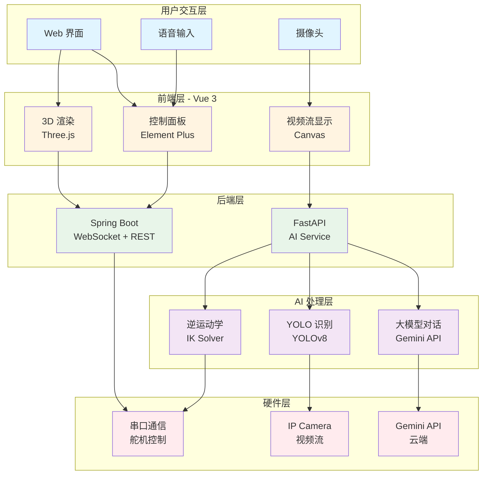
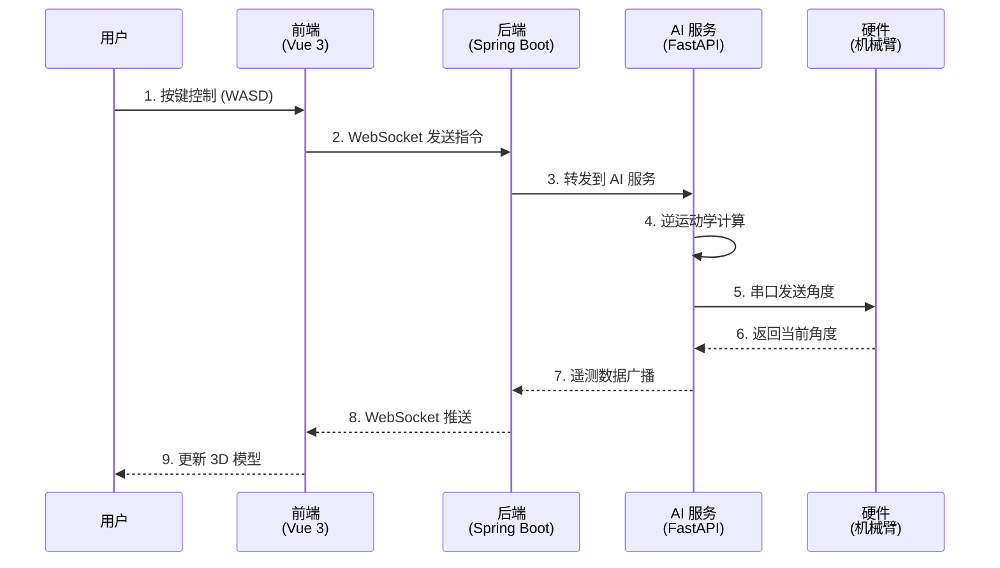
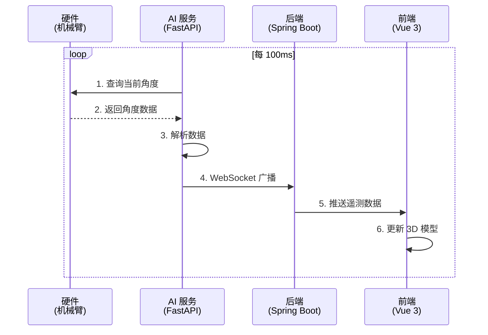
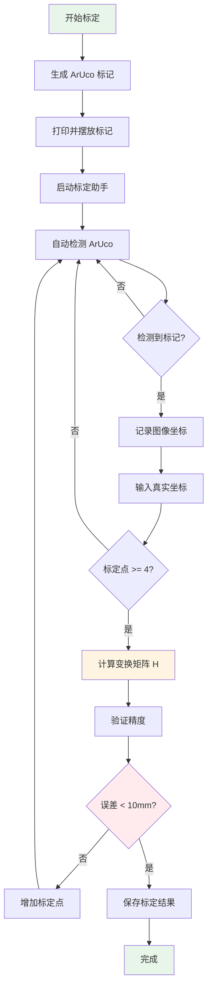
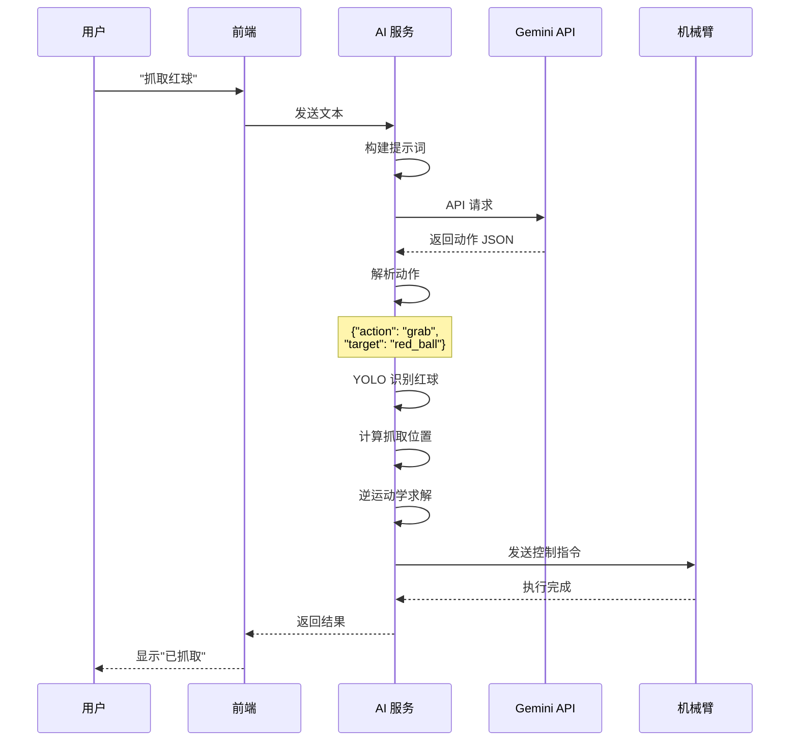
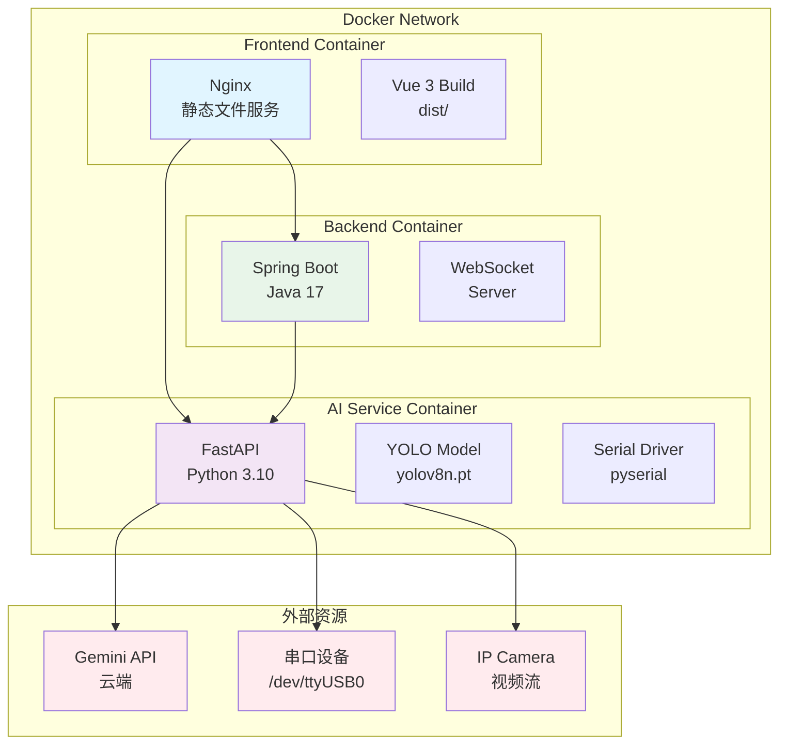
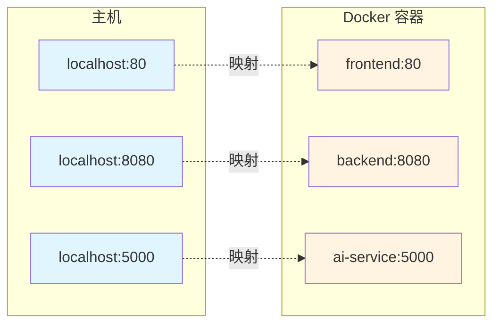
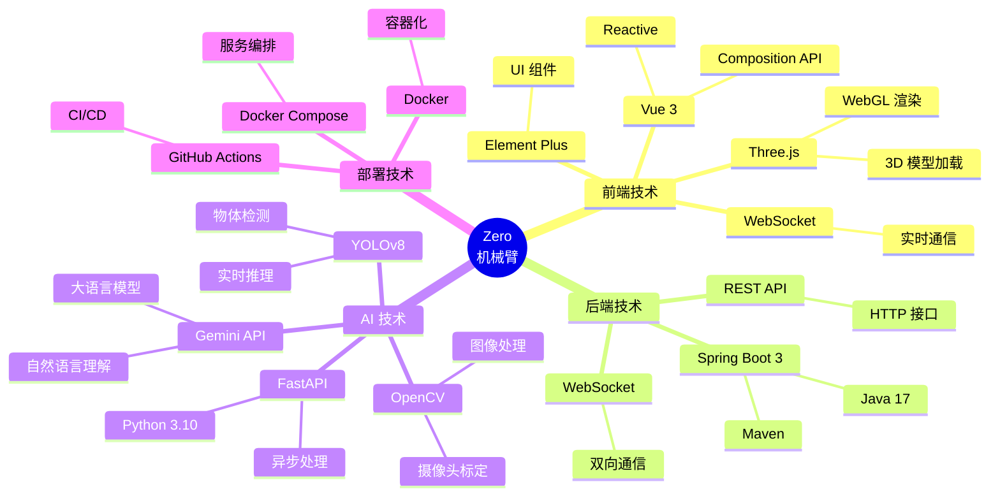
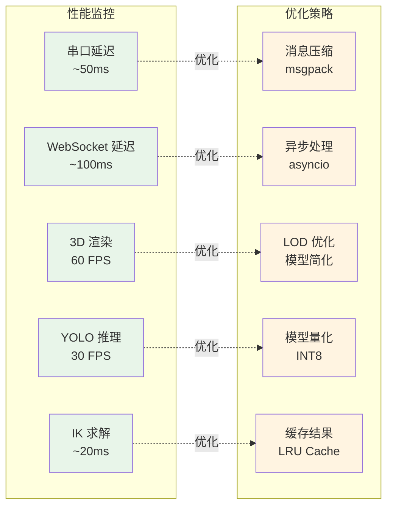
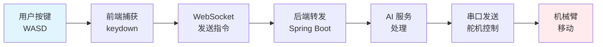

# 🗺️ Zero 机械臂系统架构流程图

> **面向对象**：PPT 组、技术评审、项目汇报
> **用途**：快速理解系统架构和数据流向
> **更新时间**：2026-01-29

---

## 📋 目录

- [整体架构图](#整体架构图)
- [数据流向图](#数据流向图)
- [视觉处理流程](#视觉处理流程)
- [大模型处理流程](#大模型处理流程)
- [部署架构图](#部署架构图)

---

## 🏗️ 整体架构图



---

## 🔄 数据流向图

### 控制指令流



### 角度回传流



---

## 📷 视觉处理流程

```mermaid
graph LR
    subgraph "视觉输入"
        A1[IP Camera<br/>视频流]
    end
    
    subgraph "图像预处理"
        B1[光照归一化<br/>CLAHE]
        B2[畸变校正<br/>Undistort]
        B3[尺寸调整<br/>Resize]
    end
    
    subgraph "YOLO 检测"
        C1[模型推理<br/>YOLOv8]
        C2[后处理<br/>NMS]
        C3[结果解析<br/>Bounding Box]
    end
    
    subgraph "坐标转换"
        D1[图像坐标<br/>(u, v)]
        D2[透视变换<br/>H Matrix]
        D3[世界坐标<br/>(x, y, z)]
    end
    
    subgraph "运动规划"
        E1[逆运动学<br/>IK Solver]
        E2[路径规划<br/>Trajectory]
        E3[串口发送<br/>Serial]
    end
    
    A1 --> B1 --> B2 --> B3
    B3 --> C1 --> C2 --> C3
    C3 --> D1 --> D2 --> D3
    D3 --> E1 --> E2 --> E3
    
    style A1 fill:#e1f5ff
    style C1 fill:#f3e5f5
    style D2 fill:#fff4e1
    style E1 fill:#e8f5e9
```

### 摄像头标定流程



---

## 🤖 大模型处理流程

```mermaid
graph TB
    subgraph "用户输入"
        A1[文本输入<br/>"抓取红球"]
        A2[语音输入<br/>Speech API]
    end
    
    subgraph "LLM 处理"
        B1[构建提示词<br/>Prompt]
        B2[Gemini API<br/>推理]
        B3[解析响应<br/>JSON]
    end
    
    subgraph "动作映射"
        C1{动作类型?}
        C2[预定义动作<br/>wave/dance]
        C3[坐标抓取<br/>grab(x,y,z)]
        C4[复合动作<br/>sequence]
    end
    
    subgraph "执行层"
        D1[逆运动学<br/>IK Solver]
        D2[路径规划<br/>Trajectory]
        D3[串口发送<br/>Serial]
    end
    
    A1 --> B1
    A2 --> B1
    B1 --> B2 --> B3
    B3 --> C1
    C1 --> C2 --> D1
    C1 --> C3 --> D1
    C1 --> C4 --> D1
    D1 --> D2 --> D3
    
    style A1 fill:#e1f5ff
    style A2 fill:#e1f5ff
    style B2 fill:#f3e5f5
    style C1 fill:#fff4e1
    style D1 fill:#e8f5e9
```

### LLM 对话示例



---

## 🐳 部署架构图

### Docker Compose 架构



### 端口映射



---

## 🔧 技术栈架构



---

## 📊 性能指标流程



---

## 🎯 使用场景流程

### 场景 1：键盘控制



### 场景 2：视觉抓取

```mermaid
graph LR
    A[用户点击<br/>画面位置] --> B[获取坐标<br/>(u, v)]
    B --> C[坐标转换<br/>H Matrix]
    C --> D[世界坐标<br/>(x, y, z)]
    D --> E[逆运动学<br/>IK Solver]
    E --> F[路径规划<br/>Trajectory]
    F --> G[串口发送<br/>Serial]
    G --> H[机械臂<br/>移动到目标]
    
    style A fill:#e1f5ff
    style C fill:#fff4e1
    style E fill:#e8f5e9
    style H fill:#ffebee
```

### 场景 3：语音控制

```mermaid
graph LR
    A[用户语音<br/>"挥挥手"] --> B[语音识别<br/>Speech API]
    B --> C[文本转换<br/>"wave"]
    C --> D[LLM 理解<br/>Gemini]
    D --> E[动作映射<br/>预定义]
    E --> F[动作序列<br/>Angles Array]
    F --> G[串口发送<br/>Serial]
    G --> H[机械臂<br/>执行动作]
    
    style A fill:#e1f5ff
    style D fill:#f3e5f5
    style H fill:#ffebee
```

---

## 📝 图例说明

### 颜色含义

- 🔵 **蓝色**：用户交互层
- 🟡 **黄色**：前端处理层
- 🟢 **绿色**：后端服务层
- 🟣 **紫色**：AI 处理层
- 🔴 **红色**：硬件设备层

### 箭头含义

- **实线箭头** (→)：数据流向
- **虚线箭头** (-.->)：优化关系
- **双向箭头** (↔)：双向通信

---

**文档版本**：v1.0
**最后更新**：2026-01-29
